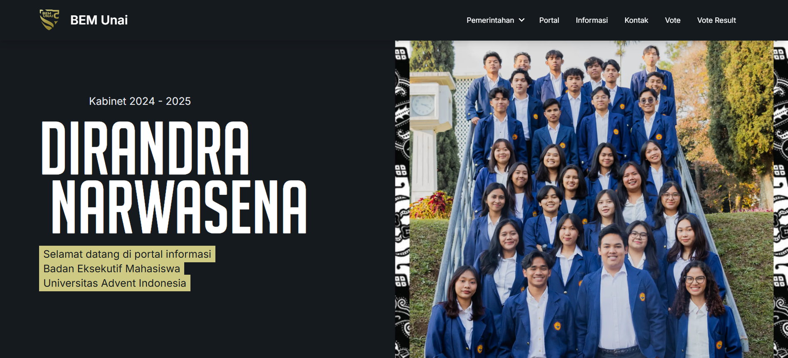

# Portal BEM UNAI

> Portal resmi Badan Eksekutif Mahasiswa Universitas Advent Indonesia



## Deskripsi

Aplikasi web ini digunakan untuk publikasi berita, pengelolaan voting, manajemen organisasi, dan komunikasi antara mahasiswa dengan pengurus BEM UNAI.

## Fitur Utama

- Manajemen berita & informasi
- Voting online (pemilihan BEM)
- Manajemen kandidat & partisipan
- Portal kontak & pengaduan
- Dashboard statistik

## Instalasi & Menjalankan Lokal

1. Clone repository:
   ```bash
   git clone https://github.com/petershaan12/bem-unai.git
   cd bem-unai
   ```
2. Install dependencies:
   ```bash
   npm install
   # atau
   yarn install
   ```
3. Copy file konfigurasi contoh jika ada:
   ```bash
   cp .env.example .env.local
   # lalu sesuaikan variabel environment
   ```
4. Jalankan development server:
   ```bash
   npm run dev
   # atau
   yarn dev
   ```
5. Buka [http://localhost:3000](http://localhost:3000) di browser.

6. Jalankan Prisma Studio dengan [http://localhost:5555](http://localhost:5555) di Browser

## Struktur Folder Penting

- `src/app/` : Halaman & API utama
- `src/components/` : Komponen UI
- `prisma/` : Skema database
- `public/` : Asset publik (gambar, font, dsb)

## Kontribusi

Kontribusi terbuka untuk pengembangan lebih lanjut. Silakan buat issue atau pull request.

## Panduan Penggunaan

### 📄 Panduan Admin

[Lihat Panduan Admin (PDF)](https://drive.google.com/file/d/19bJwAuDFPEBPaxcnXuxNwA0JBFQvWQme/view?usp=drive_link)

### 📄 Panduan User

[Lihat Panduan User (PDF)](https://drive.google.com/file/d/1_89B5yn1izsi565-fOocYTMJFo_4w4Kk/view?usp=drive_link)

## Kontak

- Email: bem@unai.edu
- Instagram: [@bem.unai](https://instagram.com/bem.unai)

---

Copyright © BEM UNAI
